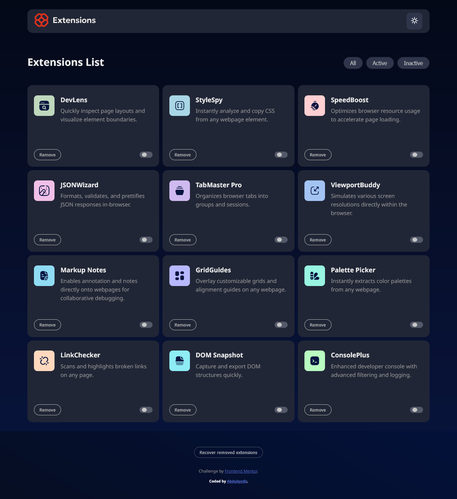
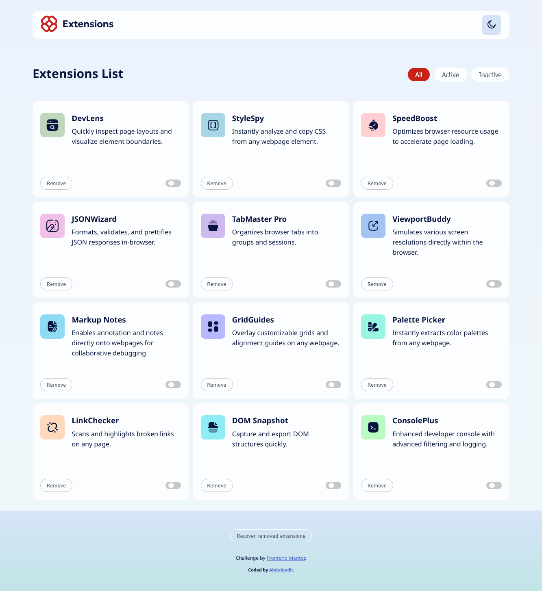

# Frontend Mentor - Browser extensions manager UI solution

This is a solution to the [Browser extensions manager UI challenge on Frontend Mentor](https://www.frontendmentor.io/challenges/browser-extension-manager-ui-yNZnOfsMAp). Frontend Mentor challenges help you improve your coding skills by building realistic projects.

## Table of contents

* [Overview](#overview)

  * [The challenge](#the-challenge)
  * [Screenshot](#screenshot)
  * [Links](#links)
* [My process](#my-process)

  * [Built with](#built-with)
  * [What I learned](#what-i-learned)
  * [Continued development](#continued-development)
  * [Useful resources](#useful-resources)
* [Author](#author)
* [Acknowledgments](#acknowledgments)

---

## Overview

### The challenge

Users should be able to:

* Toggle extensions between active and inactive states
* Filter active and inactive extensions
* Remove extensions from the list
* Select their color theme
* View the optimal layout for the interface depending on their device's screen size
* See hover and focus states for all interactive elements on the page

### Screenshot

  // dark mode
 // light mode

(Add your screenshot here when available.)

### Links

* Solution URL: [Add solution URL here]()
* Live Site URL: [Add live site URL here]()

---

## My process

### Built with

* Semantic **HTML5 markup**
* **CSS custom properties**
* **Flexbox**
* **CSS Grid**
* **Mobile-first workflow**
* **Vanilla JavaScript (no frameworks/libraries)**

---

### What I learned

This project taught me a lot about combining structure, styling, and interactivity.

Some key learnings:

* Building layouts effectively with **CSS Grid** and **Flexbox**.
* Implementing **pseudo-classes and pseudo-elements** like `:focus`, `::before`, and `::after`.
* Deepening my knowledge of **DOM manipulation** (adding, toggling, filtering, and removing elements dynamically).
* Handling **localStorage** to persist user actions like theme changes and extension states.

Here’s a small example I’m proud of:

```js
// Saving theme to localStorage
localStorage.setItem("theme", currentTheme);

// Restoring theme
const savedTheme = localStorage.getItem("theme");
if (savedTheme) {
  document.body.classList.add(savedTheme);
}
```

This project also gave me more confidence in writing **cleaner CSS sections** with comments and logical grouping.

---

### Continued development

In future projects, I want to:

* Work more with **objects** and **arrays** in JavaScript.
* Use **JSON** to create more dynamic and scalable data-driven UIs.
* Improve writing **reusable functions** and organizing code for maintainability.
* Explore how this project could be rebuilt using a framework (like React) once I’ve mastered more advanced JS concepts.

---

### Useful resources

* [The Odin Project](https://www.theodinproject.com/) - Great for learning fundamentals of DOM manipulation and JavaScript.
* [MDN Web Docs](https://developer.mozilla.org/) - My main reference for CSS properties and JavaScript functions.
* [W3Schools](https://www.w3schools.com/) - Quick lookups for syntax and examples.

---

## Author

* Frontend Mentor - [@yourusername](https://www.frontendmentor.io/profile/yourusername)
* Twitter - [@yourusername](https://www.twitter.com/yourusername)

---

## Acknowledgments

Thanks to **Frontend Mentor** for providing this challenge and helping me practice real-world projects.
Special appreciation to open-source resources like **Odin Project and MDN**, which guided me when I got stuck.

---
